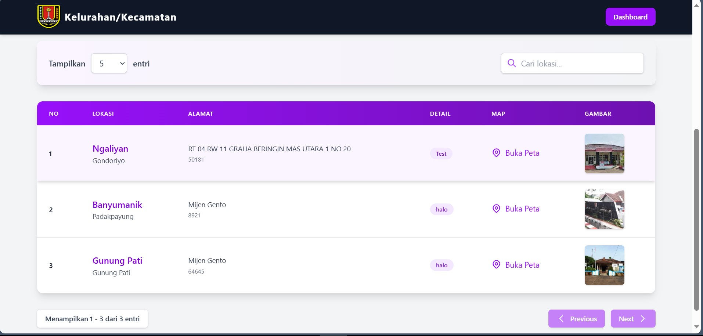
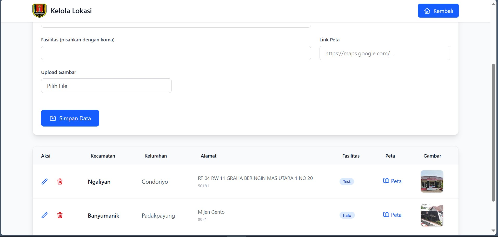

## Preview
Berikut adalah tampilan dari halaman utama dan dashboard:

*Halaman Utama - Menampilkan tabel data dengan filter dan pagination*

*Dashboard Admin - Form input dan tabel pengelolaan data*

# Kelurahan/Kecamatan Dashboard
Website ini adalah web yang dirancang untuk mengelola informasi kelurahan dan kecamatan dengan tampilan yang modern dan fungsional. Dibangun menggunakan HTML5, Tailwind CSS, dan JavaScript, proyek ini menggabungkan desain responsif dengan fitur interaktif untuk pengalaman pengguna yang optimal di berbagai perangkat.

# Fitur Utama
#### CRUD Dashboard Admin
+ Dashboard admin yang intuitif memungkinkan pengguna untuk menambah, mengedit, dan menghapus data kelurahan/kecamatan langsung ke dalam tabel. Fitur ini dilengkapi dengan pratinjau gambar, kompresi gambar otomatis, dan penyimpanan data lokal menggunakan `localStorage`.

#### Responsive Mobile dan Desktop
+ Desain yang sepenuhnya responsif memastikan website ini dapat diakses dengan nyaman baik di perangkat mobile maupun desktop. Navbar, tabel, dan form input secara otomatis menyesuaikan tata letak untuk memberikan pengalaman terbaik di semua ukuran layar.

#### Filter dan Pencarian Data
+ Pengguna dapat dengan mudah mencari data berdasarkan nama kecamatan atau kelurahan melalui kolom pencarian yang responsif, dilengkapi dengan ikon pencarian yang elegan untuk meningkatkan usability.

#### Tabel Interaktif dengan Pagination
+ Tabel data dilengkapi dengan pagination yang memungkinkan pengguna untuk mengatur jumlah entri per halaman (5, 10, 25, 50, atau 100), serta tombol navigasi `"Previous"` dan `"Next"` yang interaktif untuk memudahkan eksplorasi data.

#### Pratinjau Peta dan Gambar
+ Setiap entri data mendukung tautan peta Google Maps yang dapat diklik untuk membuka lokasi, serta pratinjau gambar lokasi dengan efek hover untuk interaksi visual yang lebih menarik.

# Cara Instalasi
### Prasyarat
+ `Node.js` dan `npm` terinstal di sistem Anda.

### Langkah-Langkah Instalasi
1. Clone Repository:
   + `git clone https://github.com/FadhliRajwaa/Tugas-web-magang.git`
   + `cd Tugas-web-magang`

2. Instal Tailwind CSS:
   + `npm install tailwindcss @tailwindcss/cli`

3. Buat File Input CSS:
   + Buat folder `src` (jika belum ada) dan tambahkan file `input.css` di dalamnya dengan konten berikut:
   + `@import "tailwindcss";`

4. Menjalankan Tailwind CSS:
   + `npx @tailwindcss/cli -i ./src/input.css -o ./src/output.css --watch`

